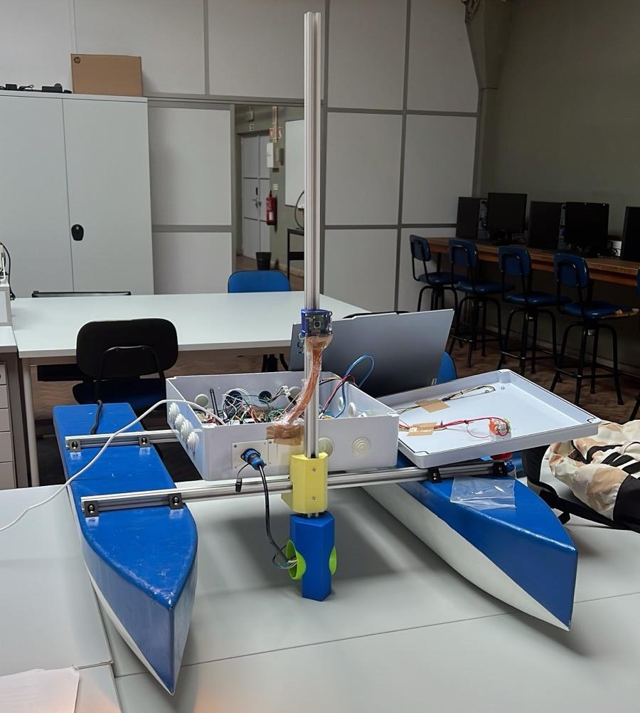

# BuoyVisionNavigation

This project implements a **Buoy Navigation** system for a 3-motor Unmanned Surface Vehicle (USV), leveraging **Computer Vision** to detect and follow red buoys autonomously.

## 📋 Overview

The system combines an **Arduino Mega** for motor control and mission management, with a **Raspberry Pi 5** for real-time image processing.

- **Manual Mode:** Full control of the boat via a remote control (NRF24L01).
- **Automatic Mode:** The boat navigates autonomously towards a red buoy detected by the camera.
- **Search Mode:** If the buoy is lost from view, the boat rotates on its axis until it finds it again.

## 📸 Media Gallery

<!-- Placeholder for project images/videos. Replace the paths below with your actual files. -->

### USV Visualization



### Navigation Demo


### Raspberry Pi Code Demo


## 🛠️ Hardware

- **Main Controller:** Arduino Mega 2560
- **Vision Processing:** Raspberry Pi 5
- **Camera:** Picamera2 (Resolution set to 1280x720)
- **Actuators:** 3 Servo Motors (Motors A, B, and C)
- **Communication:** NRF24L01 Module (Radio Frequency)
- **Indicators:** RGB LED (Yellow for Manual, Green for Automatic)
- **Remote Controller:** Arduino Nano with Joystick & NRF24L01

## 💻 Software

### Arduino Mega (`Arduino_Mega_Main.ino`)

The Arduino firmware manages:

- Receiving RF commands for manual control.
- Receiving coordinates (cx, cy) from the Raspberry Pi via Serial.
- PID control to keep the buoy centered in the image.
- State machine for switching between modes (Manual/Automatic).

### Arduino Nano (`Arduino_Nano_Controller.ino`)

The remote controller firmware handles:

- Reading joystick inputs for directional control.
- Sending control packets via NRF24L01.
- Switching between Manual and Automatic modes.

### Raspberry Pi (`Main.py`)

The Python script performs:

- Video capture with `Picamera2`.
- Image processing with OpenCV (HSV color space) to detect red color.
- Calculation of centroid and circularity of detected objects.
- Sending coordinates to the Arduino via serial port (`/dev/ttyAMA0`).

## 🚀 Installation & Setup

### Arduino Requirements

Ensure you have the following libraries installed in your Arduino IDE:

- `RF24`
- `Servo`
- `SPI`

### Raspberry Pi Requirements

The Python environment needs the following dependencies:

```bash
pip install opencv-python pyserial picamera2 numpy
```

## 🎮 Usage

1.  **Power On:** Upon startup, the system defaults to **Manual Mode** (Yellow LED).
2.  **Mode Switching:**
    - Toggle the switch on the Remote Controller to "Automatic" to activate visual navigation (Green LED).
    - Toggle back to "Manual" to regain control.
3.  **Automatic Operation:**
    - The boat will advance towards the red buoy.
    - If the buoy is lost for more than 1 second, Motor C will activate to rotate the boat and search for the target.

## 🔧 Calibration

The HSV color ranges for detection can be adjusted in `Main.py` depending on lighting conditions (values for "Generalized" and "Calibrated" are included).
